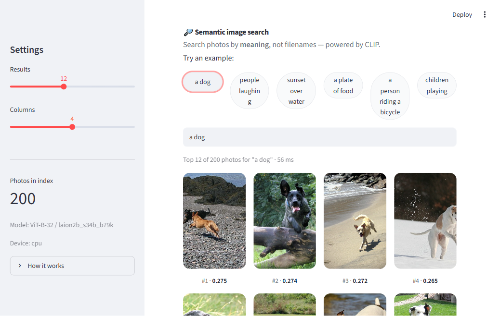

# Семантический поиск по картинкам (CLIP)

## Что это за проект

Это **поисковик по фотографиям, который ищет по смыслу, а не по названию файла**.

Я пишу текстом фразу — например, *«кот на диване»* или *«закат над водой»* — и проект
находит среди тысяч фотографий те, что **больше всего подходят под этот смысл**. При этом
поиск не смотрит на теги или имена файлов — он идёт по **содержимому самой картинки**.

По сути — это «Гугл-картинки» для готовой коллекции фотографий.

## Как это выглядит

Веб-приложение на Streamlit: вводишь запрос — получаешь фото, отсортированные по смыслу
(запрос *«a dog»* → все результаты реально собаки, поиск за ~60 мс):



## Как это работает (главная идея)

В основе — модель **CLIP**. Её суперспособность в том, что она умеет превращать **и текст,
и картинку в вектор** (набор чисел) и кладёт их в **одно общее пространство**.

Это значит, что фраза «кот на диване» и фотография кота на диване оказываются
**рядом** в этом пространстве. А раз они рядом — их близость можно измерить числом
(**косинусное сходство**). Дальше всё просто:

1. Заранее превращаю **каждую картинку** из папки в вектор → получаю список векторов.
2. Когда я ввожу запрос, превращаю **текст** в вектор той же моделью.
3. Сравниваю вектор запроса со всеми векторами картинок и показываю **самые близкие**.

> Ключевой момент: текст и картинки живут в одном пространстве, поэтому их **можно
> сравнивать напрямую**. Именно это отличает проект от обычного ResNet из ноутбука —
> тот умеет сравнивать только картинку с картинкой, а текст принять не может.

## Что умеет проект

- **Поиск текстом** — ввёл фразу, получил подходящие фотки, отсортированные по близости.
- **Карта картинок** — 2D-карта (UMAP), где похожие изображения стоят рядом, а разные —
  далеко. Раскрашена по авто-категориям (тоже через CLIP). Это главный «артефакт» проекта.
- **Поиск похожих картинок** (бонус) — «покажи ещё такие же, как эта фотка».
- **Мини-приложение** на Streamlit — окошко с полем ввода и выдачей картинок.

## Как это устроено внутри (пайплайн)

```
папка с картинками
      │
      ▼
[CLIP: encode_image]  → вектор на каждую картинку  ─┐
                                                    ├─►  косинусное сходство  ──►  топ похожих
текстовый запрос ──► [CLIP: encode_text] → вектор  ─┘
```

Плюс отдельно строится карта: все векторы картинок сжимаются из 512 измерений в 2D
через **UMAP** и рисуются точками.

## Технологии

- **CLIP** (`open_clip_torch`, модель ViT-B/32) — превращает текст и картинки в векторы.
- **NumPy** — векторы и косинусное сходство.
- **UMAP** — карта эмбеддингов в 2D.
- **Streamlit** — маленькое приложение для демо.
- **PyTorch / Pillow / tqdm** — модель, загрузка картинок, прогресс-бары.

## Данные

Готовый датасет **Flickr30k** — реальные повседневные фотографии (люди, животные, еда,
улицы). Беру не весь набор, а **подвыборку ~1500 картинок через стриминг** — так не нужно
качать многогигабайтный датасет целиком, скачиваются только те фото, что реально
используются. У каждой фотки есть 5 текстовых подписей от людей — по ним можно **честно
измерить точность поиска** (взять подпись как запрос и проверить, что нужная картинка
оказалась в топе).

## Качество поиска (честно)

На индексе из 1500 фото: **Recall@1 = 0.72, Recall@5 = 0.91** (нужное фото — первым в 72%
случаев). Плюс аудит 20 разных запросов по подписям Flickr30k — в среднем **3.4 из 6**
результатов релевантны.

- ✅ **Хорошо:** конкретный объект + действие всем телом — «собака бежит по пляжу»,
  «человек на велосипеде», «кто-то прыгает», «скалолаз», «играет на гитаре».
- ⚠️ **Хуже:** эмоции («смеются», «улыбается» — теряются), модификаторы сцены («ночью»),
  тонкие глаголы (читает vs пишет).
- ❌ **Плохо:** то, чего в датасете почти нет — «костёр», «спорткар», «лошадь» (подтягивает
  похожий фон/цвет вместо объекта).

Это ограничение **данных**, а не модели: Flickr30k — про людей и их действия. Полный отчёт
в `outputs/quality_report.json`.

## Чему я тут учусь

- **Эмбеддинги** — как превратить данные в векторы.
- **Мультимодальность** — как текст и картинки попадают в одно пространство (основа
  почти всего современного AI).
- **Косинусное сходство и поиск ближайших соседей** — как работает поиск по смыслу.
- **Кластеризация и снижение размерности** — как из векторов сделать понятную карту.

> Полный технический план сборки — в [CLAUDE.md](CLAUDE.md).
